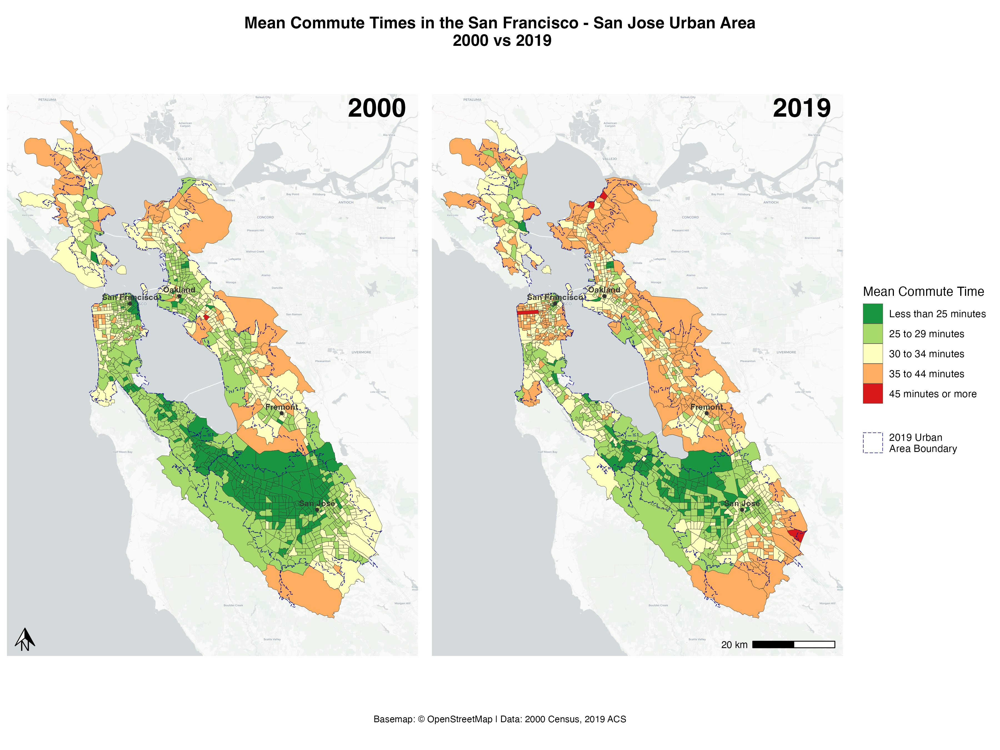
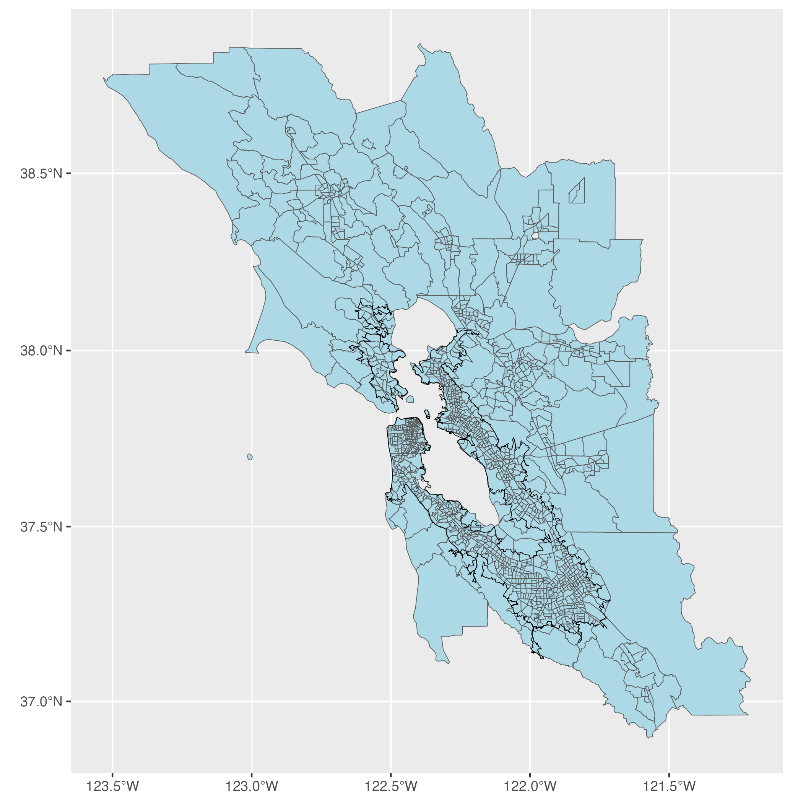
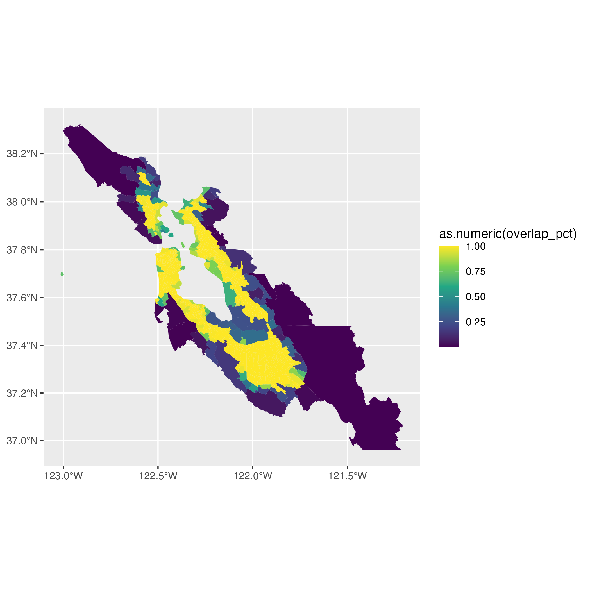
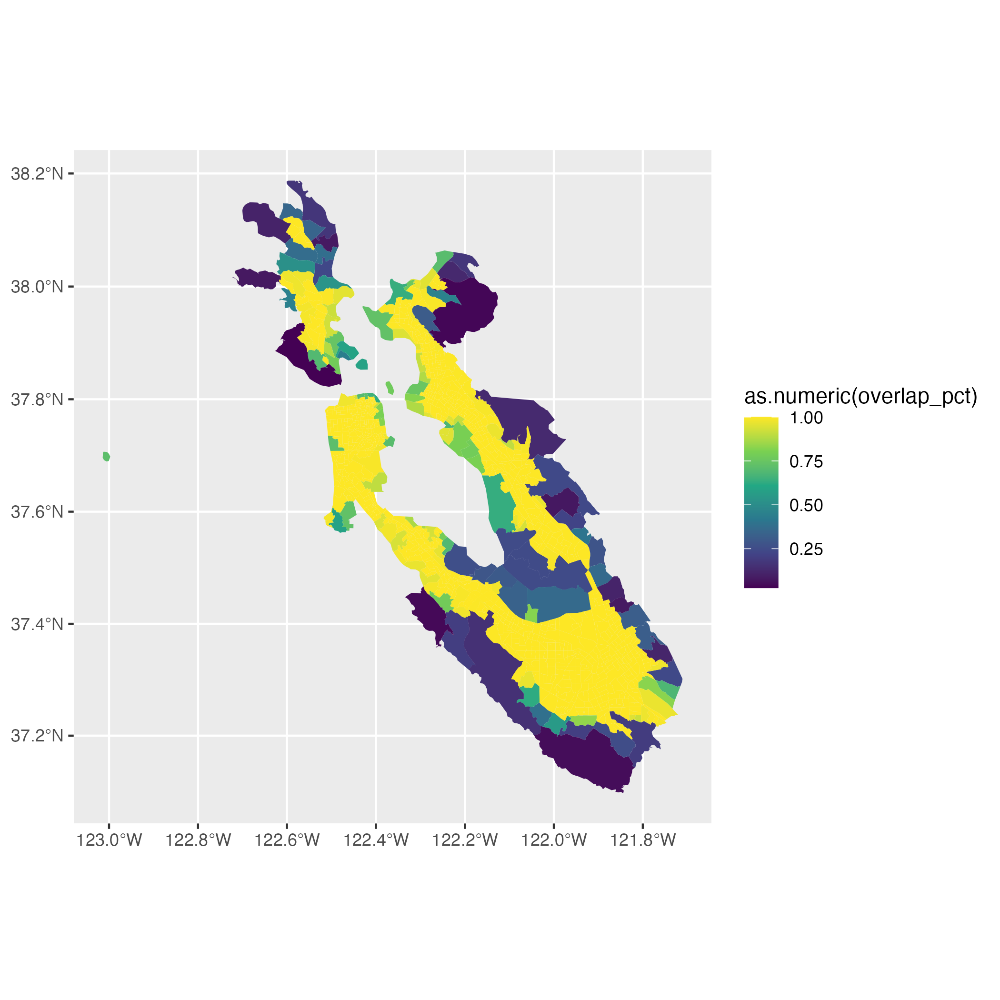

# GEOG 172 - Cartography and Data Visualization

SJSU Winter 2026

## final project

My final project creates map with R of mean commute time in the San Franciso - San José urban area in 2000 and 2019 using data from the 2000 decennial census and the 2019 American Community Survey (ACS).



Key libraries include

  - `cowplot` - assembling components in a grid layout
  - `dplyr` - data wrangling
  - `ggplot2` - plotting and annotating maps
  - `ggspatial` - basemap and annotations
  - `sf` - geometry operations including urban area overlap
  - `tidycensus` - fetch ACS and decennial census data
  - `tidygeocoder` - geocoding cities
  - `tigris` - urban area boundaries

### Proposal

[Is Bay Area traffic getting worse?](final/proposal.pdf)

### Data

  - 2019 ACS: `S0801_C01_046` Total: Workers 16 years and over who did not work from home: TRAVEL TIME TO WORK: Mean travel time to work (minutes)
  - 2000 Decennial Census: `P033001` Aggregate travel time to work (in minutes) Aggregate travel time to work (in minutes) by travel time to work by means of transportation to work for workers 16 years and over who did not work at home and `P031002` Total: Did not work at home travel time to work for workers 16 years and over
  - 2019 urban area boundaries from `tigris::urban_areas()`

### Interesting bits

#### Urban area

I started with the nine Bay Area counties (Alameda, Contra Costa, Marin, Napa, San Francisco, San Mateo, Santa Clara, Solano, Sonoma). These encompass a large area, and large rural census tracts visually dominated the display. To focus on the San Jose to San Francisco area, I used the urban areas polygons from `tigris`. I included only census tracts where at least 2.5% of their area overlaps the urban area.

|  |  |  |
|:--:|:--:|:--:|
| Bay Area counties | Overlap percent for intersecting areas | Filtered tracts with ≥2.5% overlap |

I used the 2019 boundaries on both maps for consistency; this data is not currently available for years prior to 2011.

#### Categorical buckets

The `S0801_C01_046` and `P033001`/`P031002` variables are mean (continuous) values, which aren't ideal for mapping.

The data from census variable `B08303` uses these buckets; they are mostly but not entirely 5-minute resolution, and the top bucket is unbounded:

  - Less than 5 minutes
  - 5 to 9 minutes
  - 10 to 14 minutes
  - 15 to 19 minutes
  - 20 to 24 minutes
  - 25 to 29 minutes
  - 30 to 34 minutes
  - 35 to 39 minutes
  - 40 to 44 minutes
  - 45 to 59 minutes
  - 60 to 89 minutes
  - 90 or more minutes

Summary of values in metro areas for both years:

```
    Min. 1st Qu.  Median    Mean 3rd Qu.    Max.
  10.00   26.78   30.11   30.09   33.45   57.90
```

I used these buckets to get readable rounded values, consistent bucket ranges, and better visual discrimination:

  - Less than 25 minutes
  - 25 to 29 minutes
  - 30 to 34 minutes
  - 35 to 44 minutes
  - 45 minutes or more


## setup

### texts

  - Wickham, Hadley & Garret Grolemund. [R for Data Science](http://r4ds.had.co.nz)
  - Lovelace, Robin, Jakub Nowosad & Jannes Muenchow. [Geocomputation with R](https://geocompr.robinlovelace.net)
  - Walker, Kyle.[Analyzing US Census Data: Methods, Maps, and Models in R](https://walker-data.com/census-r/)
  - Wilke, Claus O. [Fundamentals of Data Visualization](https://clauswilke.com/dataviz)

### R development environment

[renv](https://rstudio.github.io/renv/articles/renv.html) for package management

Set up with `renv`

```
install.packages("renv")
renv::init()
install.packages("languageserver")
install.packages("rmarkdown")
install.packages("remotes")
remotes::install_github("ManuelHentschel/vscDebugger")
remotes::install_github("nx10/httpgd")
install.packages("lintr")
install.packages("styler")
install.packages("rsconnect")
renv::snapshot(type = "all", prompt = FALSE)
```

### VSCode

[R Extension for Visual Studio Code](https://github.com/REditorSupport/vscode-R/wiki/Installation:-macOS)

  - + [VSCode-R-Debugger extension](https://marketplace.visualstudio.com/items?itemName=RDebugger.r-debugger) `RDebugger.r-debugger`


### Rendering output

  - install [Quarto](https://quarto.org/docs/computations/r.html)
  - `Sys.setenv(RSTUDIO_PANDOC = "/usr/local/bin/quarto")`

